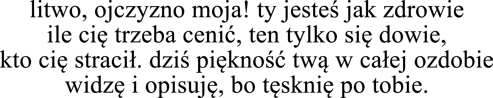
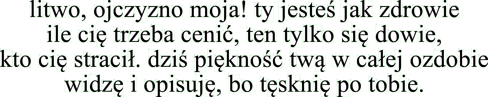
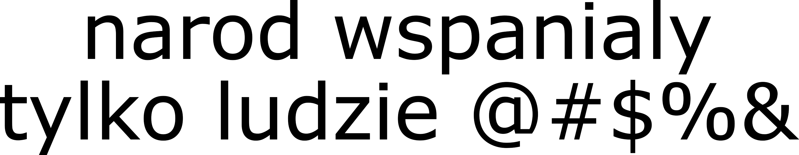
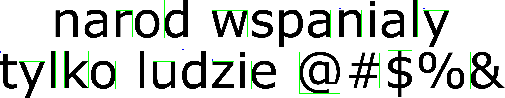
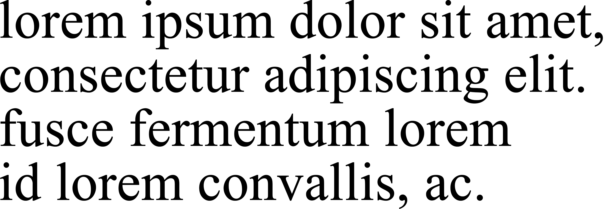
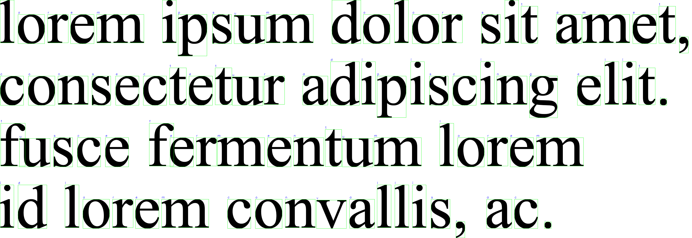
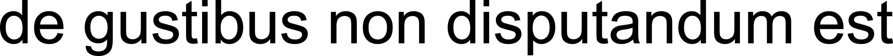
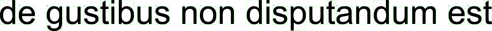

# OCR_in_Cpp: Prosty System Rozpoznawania Znaków

[](https://opencv.org/)
[](https://cmake.org/)
[](https://isocpp.org/)

Prosty system Optycznego Rozpoznawania Znaków (OCR) zaimplementowany w języku C++ z wykorzystaniem biblioteki OpenCV. Projekt skupia się na segmentacji znaków z obrazu, ich normalizacji oraz rozpoznawaniu na podstawie dopasowania do szablonów.

## 🌟 Główne Funkcje

*   **Wczytywanie i Przetwarzanie Obrazu:** Wczytuje obraz, konwertuje go do skali szarości, stosuje rozmycie Gaussa i binaryzację metodą Otsu w celu przygotowania do dalszej analizy.
*   **Segmentacja Znaków:** Wykorzystuje detekcję konturów do wyodrębniania potencjalnych znaków. Zawiera specjalną logikę do łączenia trzonu litery 'i' (oraz podobnych jak 'j', '!', '?') z jej kropką/znakiem diakrytycznym. Segmentowane znaki są sortowane w kolejności czytania (od lewej do prawej, od góry do dołu).
*   **Normalizacja Znaków:** Każdy wysegmentowany znak jest normalizowany do rozmiaru 32x32 pikseli z zachowaniem proporcji i dodaniem marginesu (paddingu).
*   **Rozpoznawanie Znaków:** Używa metody `cv::matchTemplate` (TM_CCOEFF_NORMED) do porównywania znormalizowanego obrazu znaku z predefiniowaną bazą szablonów znaków.
*   **Rekonstrukcja Tekstu:** Na podstawie pozycji rozpoznanych znaków oraz średniej szerokości znaku, system rekonstruuje tekst, dodając spacje i znaki nowej linii.
*   **Wizualizacja Wyników:** Wyświetla oryginalny obraz z zaznaczonymi ramkami wokół wykrytych znaków oraz etykietami rozpoznanych liter. Zapisuje również wynikowy obraz.
*   **Ocena Dokładności:** Porównuje rozpoznany tekst z tekstem referencyjnym (ground truth) i oblicza procent poprawnie rozpoznanych znaków (ignorując białe znaki).
*   **Zliczanie Wystąpień Liter:** Raportuje liczbę wystąpień każdej rozpoznanej litery alfabetu.

## 📁 Struktura Projektu

```
OCR_in_Cpp/
├── assets/         # Folder z szablonami znaków (np. a/, b/, dot/, comma/, etc.)
│   ├── a/
│   │   └── template1.png
│   │   └── template2.png
│   │   └── ...
│   ├── b/
│   │   └── ...
│   ├── dot/
│   │   └── template1.png
│   │   └── ...
│   └── ...
├── img/            # Folder z obrazami testowymi
│   ├── test_image1.png
│   ├── test_image1_result.png
│   ├── ...
│   └── test_image5.png
│   └── test_image5_result.png
├── main.cpp        # Główny plik źródłowy projektu
├── CMakeLists.txt  # Plik konfiguracyjny CMake
└── README.md       # Ten plik
```

## 🛠️ Wymagania i Instalacja

### Wymagania:

1.  **Kompilator C++:** Obsługujący standard C++20 (np. GCC, Clang, MinGW).
2.  **CMake:** Wersja 3.10 lub nowsza.
3.  **OpenCV:** Wersja 4.x. Upewnij się, że OpenCV jest poprawnie zainstalowane i dostępne dla CMake (np. poprzez ustawienie `OpenCV_DIR` lub dodanie do PATH).

### Budowanie Projektu:

1.  Sklonuj repozytorium (jeśli jest na GitHubie) lub utwórz strukturę projektu jak powyżej.
2.  Utwórz folder `build` w głównym katalogu projektu:
    ```bash
    mkdir build
    cd build
    ```
3.  Skonfiguruj projekt za pomocą CMake:
    ```bash
    cmake ..
    # Dla użytkowników MinGW/MSYS w Windows, możesz potrzebować wskazać generator:
    # cmake -G "MinGW Makefiles" ..
    # lub dla Visual Studio:
    # cmake -G "Visual Studio 16 2019" ..
    ```
4.  Skompiluj projekt:
    ```bash
    cmake --build .
    # lub używając make (dla MinGW/Linux):
    # make
    ```
    Plik wykonywalny (np. `OCR_in_Cpp.exe` lub `OCR_in_Cpp`) pojawi się w folderze `build` (lub podfolderze takim jak `build/Debug`).

## 🚀 Uruchamianie

1.  Upewnij się, że folder `assets/` z szablonami znaków oraz folder `img/` z obrazami testowymi znajdują się w odpowiednim miejscu względem pliku wykonywalnego (domyślnie, jeśli uruchamiasz z folderu `build`, ścieżki `../assets/` i `../img/` powinny działać). Ścieżki są zdefiniowane w `main.cpp` jako `IMAGE_FOLDER` i `folderSzablonow`.
2.  W pliku `main.cpp` możesz zmienić:
    *   `IMAGE_NAME`: aby wybrać inny obraz testowy z folderu `img/`.
    *   `tekstGroundTruth`: aby dostosować tekst referencyjny dla wybranego obrazu.
3.  Uruchom program z folderu `build`:
    ```bash
    ./OCR_in_Cpp
    # lub w Windows:
    # .\OCR_in_Cpp.exe
    ```
    Program wyświetli przetworzony obraz z rozpoznanymi znakami oraz wypisze zrekonstruowany tekst i statystyki w konsoli.

## ⚙️ Jak To Działa? (Szczegółowy Opis Kodu)

Projekt realizuje proces OCR w kilku kluczowych krokach:

1.  **`wczytajSzablonyZnakowObrazy(folderGlownySzablonow, alfabet)`**:
    *   Iteruje po znakach zdefiniowanych w `alfabetDoRozpoznania`.
    *   Dla każdego znaku, tworzy ścieżkę do odpowiedniego podfolderu w `folderGlownySzablonow` (np. `assets/a/`, `assets/dot/`).
    *   Wczytuje wszystkie obrazy z danego podfolderu jako szablony.
    *   Każdy obraz szablonu jest konwertowany do skali szarości, binaryzowany (THRESH_BINARY_INV | THRESH_OTSU), a następnie normalizowany do rozmiaru 32x32 z paddingiem za pomocą `stworzObrazZPaddingiem`.
    *   Znormalizowane szablony wraz z odpowiadającymi im znakami są przechowywane w wektorze `SzablonObrazu`.

2.  **`wczytajIPrzetworzWstepnie(sciezkaObrazu, sukces)`**:
    *   Wczytuje obraz testowy w kolorze.
    *   Konwertuje go do skali szarości.
    *   Stosuje rozmycie Gaussa (`cv::GaussianBlur`) z jądrem 3x3 w celu redukcji szumów.
    *   Binaryzuje obraz za pomocą `cv::threshold` z flagami `THRESH_BINARY_INV | THRESH_OTSU`. `THRESH_BINARY_INV` zapewnia, że znaki są białe na czarnym tle, co jest często standardem w przetwarzaniu obrazów. `THRESH_OTSU` automatycznie dobiera próg binaryzacji.

3.  **`segmentujNormalizujZnaki(obrazBinarnyWejsciowy, obrazSzaryOryginal, obrazKolorowyOryginal, pozycjeZnakowOriginal)`**:
    *   Główna funkcja odpowiedzialna za znalezienie i wyizolowanie poszczególnych znaków.
    *   **Detekcja Konturów:** Używa `cv::findContours` na obrazie binarnym (`RETR_EXTERNAL` aby znaleźć tylko zewnętrzne kontury, `CHAIN_APPROX_SIMPLE` aby skompresować segmenty konturów).
    *   **Filtrowanie i Łączenie Konturów:**
        *   Oblicza prostokąty ograniczające (`cv::boundingRect`) dla każdego konturu.
        *   Implementuje logikę łączenia "trzonu" litery (np. dolna część 'i', 'j', '!', '?') z jej "kropką" lub górnym elementem. Kryteria łączenia bazują na rozmiarze, proporcjach i względnym położeniu potencjalnych części znaku.
        *   Filtruje prostokąty na podstawie ich pola, wysokości i szerokości, aby odrzucić szum i zbyt małe/duże elementy.
    *   **Normalizacja Wysegmentowanych Znaków:**
        *   Dla każdego finalnego prostokąta (kandydata na znak), wycina odpowiadający mu region (ROI) z *oryginalnego obrazu w skali szarości*.
        *   Ten ROI jest następnie binaryzowany (ponownie `THRESH_BINARY_INV | THRESH_OTSU`) i normalizowany do rozmiaru 32x32 z paddingiem za pomocą `stworzObrazZPaddingiem`.
    *   **Sortowanie Znaków:** Wysegmentowane i znormalizowane znaki (wraz z ich oryginalnymi pozycjami) są sortowane. Kryterium sortowania: najpierw według współrzędnej Y środka prostokąta (z pewną tolerancją, aby znaki w tej samej linii były grupowane), a następnie według współrzędnej X. Zapewnia to kolejność czytania od lewej do prawej, od góry do dołu.

4.  **`stworzObrazZPaddingiem(obrazWejsciowyBinarny, docelowyRozmiarFinalny, padding)`**:
    *   Przeskalowuje `obrazWejsciowyBinarny` tak, aby zmieścił się w `docelowyRozmiarFinalny` (np. 32x32) pomniejszonym o `padding` z każdej strony, zachowując proporcje.
    *   Tworzy nowy, czarny obraz o `docelowyRozmiarFinalny`.
    *   Umieszcza przeskalowany obraz wejściowy na środku tego nowego obrazu, tworząc efekt paddingu.
    *   Zapewnia, że wynikowy obraz jest typu `CV_8U`.

5.  **`rozpoznajZnakPrzezMatchTemplate(obrazSegmentowany32x32, bazaSzablonowObrazow, segmentIndexForDebug)`**:
    *   Przyjmuje znormalizowany obraz znaku (32x32, CV_8U).
    *   Porównuje go z każdym szablonem w `bazaSzablonowObrazow` za pomocą `cv::matchTemplate` z metodą `TM_CCOEFF_NORMED`. Ta metoda zwraca mapę korelacji; interesuje nas maksymalna wartość korelacji.
    *   Znak z szablonu, który dał najwyższy współczynnik korelacji, jest uznawany za rozpoznany znak.
    *   Jeśli obraz wejściowy jest nieprawidłowy lub baza szablonów jest pusta, zwraca '#'.

6.  **`rekonstruujTekst(rozpoznaneZnaki, pozycjeZnakow)`**:
    *   Iteruje po posortowanej liście rozpoznanych znaków i ich oryginalnych pozycjach.
    *   **Wykrywanie Nowych Linii:** Jeśli współrzędna Y bieżącego znaku jest znacznie większa niż współrzędna Y poprzedniego znaku (plus jego wysokość), dodawany jest znak nowej linii `\n`.
    *   **Wykrywanie Spacji:** Jeśli bieżący znak (nie będący znakiem interpunkcyjnym bezpośrednio po literze) jest oddalony w osi X od poprzedniego znaku o więcej niż pewien próg (obliczany na podstawie średniej szerokości znaku, np. `sredniaSzerokoscZnaku * 0.30`), dodawana jest spacja.
    *   Składa rozpoznane znaki, spacje i nowe linie w finalny ciąg tekstowy.

7.  **`main()`**:
    *   Inicjalizuje ścieżki, alfabet.
    *   Wywołuje `wczytajSzablonyZnakowObrazy`.
    *   Wczytuje obraz testowy i przetwarza go wstępnie (`wczytajIPrzetworzWstepnie`).
    *   Segmentuje i normalizuje znaki (`segmentujNormalizujZnaki`).
    *   Rozpoznaje każdy znak (`rozpoznajZnakPrzezMatchTemplate`).
    *   Rekonstruuje tekst (`rekonstruujTekst`).
    *   Wyświetla wyniki, zlicza litery, oblicza dokładność (jeśli `tekstGroundTruth` jest dostępny).
    *   Rysuje prostokąty i rozpoznane znaki na oryginalnym obrazie kolorowym i wyświetla/zapisuje go.

## 📊 Przykłady Testowe i Wyniki

Poniżej znajdują się wyniki działania programu dla dostarczonych obrazów testowych.

---

**Test 1: `test_image1.png` (Litwo, ojczyzno moja...)**

*   **Obraz Wejściowy:**
    
*   **Obraz Wynikowy:**
    
*   **Rozpoznany Tekst (z konsoli):**
    ```
    litwo r
    , oj czyzno moj a.! ty j estes j ak zdrowie
    ile ci9 trzeba cenicr
    , ten tylko si9 dowie,
    kto cig straci1. dzisr pigknosr cr tw4 w ca1ej ozdobie
    widz9 i opisuj 9, bo tgskni9 po tobie.
    ```
*   **Ground Truth:** `litwo, ojczyzno moja! ty jesteś jak zdrowie ile cię trzeba cenić, ten tylko się dowie, kto cię stracił. dziś piękność twą w całej ozdobie widzę i opisuję, bo tęsknię po tobie.`
*   **Dokładność :** Nie za wysoka. Spowodowana inną czcionką oraz polskimi znakami do, których nie było szablonów.

---

**Test 2: `test_image2.png` (narod wspanialy...)**

*   **Obraz Wejściowy:**
    
*   **Obraz Wynikowy:**
    
*   **Rozpoznany Tekst (z konsoli):**
    ```
    n a rod wspa n i a lytyl ko l u dzi e.., oxoa
    ```
*   **Ground Truth:** `narod wspanialy tylko ludzie @#$%&`
*   **Dokładność:** Dobra dla liter, znaki specjalne (np. `@#$%&`) nie są w alfabecie i są rozpoznawane błędnie. Niestety zastosowana czcionka miała za szeroki rozstaw liter i wykrywanie spacji dobrze nie zadziałało.

---

**Test 3: `test_image3.png` (lorem ipsum...)**

*   **Obraz Wejściowy:**
    
*   **Obraz Wynikowy:**
    
*   **Rozpoznany Tekst (z konsoli):**
    ```
    lorem ipsum dolor sit amet,
    consectetur adipiscing elit.
    fusce fermentum lorem
    id lorem convallis, ac.
    ```
*   **Ground Truth:** `lorem ipsum dolor sit amet, consectetur adipiscing elit. fusce fermentum lorem id lorem convallis, ac.`
*   **Dokładność:** Bardzo wysoka dla tego fontu (był w szablonie) i jakości obrazu.

---

**Test 4: `test_image4.png` (de gustibus...)**

*   **Obraz Wejściowy:**
    
*   **Obraz Wynikowy:**
    
*   **Rozpoznany Tekst (z konsoli):**
    ```
    de g usti bus non d isputand u m est
    ```
*   **Ground Truth:** `de gustibus non disputandum est`
*   **Dokładność:** Bardzo wysoka. Niepatrząc na znaki białe skuteczność nawet 100%. Czcionka inna niż w szblonach, ale na tyle podobna, że rozpoznał dobrze.

---

**Test 5: `test_image5.png` (czcionka cambria...)**

*   **Obraz Wejściowy:**
    
*   **Obraz Wynikowy:**
    
*   **Rozpoznany Tekst (z konsoli):**
    ```
    czcionka cambria
    zobaczymy czy dzia1a
    test test test
    nie mam 1uz pomys1u
    ```
*   **Ground Truth (z kodu):** `czcionka cambria zobaczymy czy dziala test test test nie mam juz pomyslu`
*   **Dokładność (z konsoli dla tego testu):** Wysoka, prawie zgodna z ground truth. Problem z znakami z korpkami

---

## 📄 Zadanie 2 OCR (Treść Polecenia)

Poniżej znajduje się oryginalna treść zadania, która była inspiracją dla tego projektu:

> **Zadanie 2 OCR**
>
> Napisz program przekształacający obraz w tekst, przyjmując następujące założenia:
>
> 1.  Na obrazie znajduje się tekst złożony z małych liter alfabetu łacińskiego oraz cyfr
> 2.  Na obrazie występuje jeden typ i rozmiar czcionki
> 3.  Weź pod uwagę czcionki szeryfowe i bezszeryfowe
> 4.  W tekście występują znaki przestankowe: `.` `,` `?` `!`
> 5.  Tekst składa się z wielu linii
> 6.  Tekst może być obrócony (krzywo zeskanowany w całości)
> 7.  Program powinien zwracać tekst wraz ze znakami białymi i znakami nowych linii
> 8.  Program może raportować procent poprawnie rozpoznanych liter dla pre-definiowanych obrazów testowych
> 9.  Program powinien dodatkowo zliczać liczbę wystąpień każdej litery
> 10. Należy zastosować operację splotu i DFT albo inne metody (klasyfikacja)
> 11. Należy dokonać redukcji szumu na obrazie wejściowym

**Uwagi dotyczące implementacji względem polecenia:**
*   Punkt 1, 3, 4, 5, 7, 8, 9, 11 są w dużej mierze zaimplementowane.
*   Punkt 2 (jeden typ i rozmiar czcionki): program radzi sobie z różnymi czcionkami, o ile szablony są odpowiednio przygotowane. Nie jest ograniczony do jednego typu.
*   Punkt 6 (obrócony tekst): Aktualna implementacja nie zawiera zaawansowanego mechanizmu korekcji globalnego obrotu obrazu. Radzi sobie z niewielkimi lokalnymi rotacjami znaków.
*   Punkt 10 (splot i DFT): Zastosowano metodę dopasowania szablonów (`cv::matchTemplate`), która wewnętrznie wykorzystuje operacje korelacji (podobne do splotu). DFT nie jest bezpośrednio używane do klasyfikacji.

## 💡 Potencjalne Ulepszenia

*   **Obsługa Polskich Znaków Diakrytycznych:** Dodanie szablonów dla liter takich jak `ą`, `ę`, `ć`, `ł`, `ń`, `ó`, `ś`, `ź`, `ż`.
*   **Obsługa Wielkich Liter i Cyfr:** Rozszerzenie alfabetu i bazy szablonów.
*   **Wykrywanie obrotu:** Implementacja algorytmu do wykrywania i korygowania globalnego nachylenia tekstu na obrazie.
*   **Bardziej Zaawansowana Segmentacja:** Ulepszenie logiki segmentacji, np. poprzez analizę linii bazowych tekstu, histogramy projekcji, czy adaptacyjne metody łączenia komponentów.
*   **Lepsze Wykrywanie Spacji/Nowych Linii:** Bardziej zaawansowana analiza odstępów między znakami i liniami, być może oparta na statystykach z całego dokumentu.

---

Stworzone przez Szymon Kłodowski
