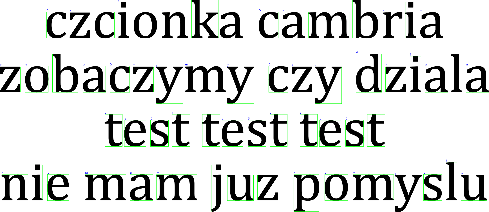

# OCR_in_Cpp: Prosty System Rozpoznawania Znaków

[](https://opencv.org/)
[](https://cmake.org/)
[](https://isocpp.org/)
[-lightgrey.svg)](https://gcc.gnu.org/)

Prosty system Optycznego Rozpoznawania Znaków (OCR) zaimplementowany w języku C++ z wykorzystaniem biblioteki OpenCV. Projekt skupia się na segmentacji znaków z obrazu, ich normalizacji oraz rozpoznawaniu na podstawie dopasowania do szablonów, z wykorzystaniem transformaty Fouriera (DFT) do obliczenia korelacji.

## 🌟 Główne Funkcje

*   **Interaktywne Uruchamianie:** Program pyta użytkownika o nazwę pliku obrazu do przetworzenia oraz opcjonalnie o tekst referencyjny (ground truth) do oceny dokładności.
*   **Wczytywanie i Przetwarzanie Obrazu:** Wczytuje obraz, konwertuje go do skali szarości, stosuje rozmycie Gaussa i binaryzację metodą Otsu.
*   **Segmentacja Znaków:** Wykorzystuje detekcję konturów. Zawiera logikę łączenia trzonu litery (np. 'i', 'j') z jej kropką. Segmentowane znaki są sortowane w kolejności czytania.
*   **Normalizacja Znaków:** Każdy wysegmentowany znak jest normalizowany do rozmiaru 32x32 pikseli z zachowaniem proporcji i dodaniem marginesu (paddingu).
*   **Rozpoznawanie Znaków:** Porównuje znormalizowany obraz znaku z bazą szablonów. Główna metoda rozpoznawania manualnie oblicza znormalizowany współczynnik korelacji krzyżowej (NCC) z wykorzystaniem Dyskretnej Transformaty Fouriera (DFT) do obliczenia licznika korelacji.
*   **Rekonstrukcja Tekstu:** Na podstawie pozycji rozpoznanych znaków i średniej szerokości znaku, system rekonstruuje tekst, dodając spacje i znaki nowej linii.
*   **Wizualizacja Wyników:** Wyświetla oryginalny obraz z zaznaczonymi ramkami wokół wykrytych znaków oraz etykietami rozpoznanych liter. Zapisuje również wynikowy obraz.
*   **Ocena Dokładności:** Porównuje rozpoznany tekst z tekstem referencyjnym (ground truth) i oblicza procent poprawnie rozpoznanych znaków (ignorując białe znaki).
*   **Zliczanie Wystąpień Liter:** Raportuje liczbę wystąpień każdej rozpoznanej litery alfabetu.

## 📁 Struktura Projektu

```
OCR_in_Cpp/
├── assets/         # Folder z szablonami znaków (np. a/, b/, dot/, comma/, etc.)
│   ├── a/
│   │   └── template1.png
│   │   └── ...
│   ├── b/
│   │   └── ...
│   └── ...
├── img/            # Folder z obrazami testowymi
│   ├── test_image1.png
│   ├── test_image1_result.png
│   ├── ...
│   └── test_image5.png
│   └── test_image5_result.png
├── main.cpp        # Główny plik źródłowy projektu
├── CMakeLists.txt  # Plik konfiguracyjny CMake
└── README.md       # Ten plik
```

## 🛠️ Wymagania i Instalacja

### Wymagania:

1.  **Kompilator C++:** Obsługujący standard C++20. Testowano z:
    *   MinGW-W64 (GCC 13.2.0 lub nowszy)
    Inne kompatybilne kompilatory: Clang 10/12+, MSVC (Visual Studio 2019 v16.10+ lub Visual Studio 2022).
2.  **CMake:** Wersja 3.30 lub nowsza (zgodnie z `CMakeLists.txt`). Testowano z 3.28.2, ale projekt wymaga 3.30.
3.  **OpenCV:** Wersja 4.11.0 lub nowsza (testowano z 4.11.0). Wymagane moduły: `core`, `imgcodecs`, `imgproc`. Upewnij się, że OpenCV jest poprawnie zainstalowane i dostępne dla CMake.

### Budowanie Projektu:

1.  Sklonuj repozytorium lub utwórz strukturę projektu jak powyżej.
2.  Upewnij się, że masz zainstalowany CMake w wersji co najmniej 3.30.
3.  Utwórz folder `build` w głównym katalogu projektu:
    ```bash
    mkdir build
    cd build
    ```
4.  Skonfiguruj projekt za pomocą CMake (dostosuj generator do swojego systemu):
    ```bash
    # Dla MinGW Makefiles (jeśli używasz GCC/MinGW)
    cmake -G "MinGW Makefiles" ..
    
    # Przykładowo dla Visual Studio
    # cmake -G "Visual Studio 17 2022" ..

    # Dla domyślnego generatora na Linux/macOS
    # cmake ..
    ```
5.  Skompiluj projekt:
    ```bash
    cmake --build .
    # lub bezpośrednio używając make (dla MinGW):
    # mingw32-make
    ```
    Plik wykonywalny (np. `OCR_in_Cpp.exe`) pojawi się w folderze `build`.

## 🚀 Uruchamianie

1.  Upewnij się, że foldery `assets/` (z szablonami) i `img/` (z obrazami testowymi) znajdują się w odpowiednim miejscu względem pliku wykonywalnego (domyślnie, jeśli uruchamiasz z folderu `build`, ścieżki `../assets/` i `../img/` powinny działać).
2.  Uruchom program z folderu `build`:
    ```bash
    .\OCR_in_Cpp.exe
    # lub dla systemów Unix-like:
    # ./OCR_in_Cpp
    ```
3.  Program poprosi o podanie nazwy pliku obrazu (np. `test_image1.png`), który musi znajdować się w folderze `img/`.
4.  Następnie program zapyta o opcjonalne podanie tekstu referencyjnego (ground truth) dla tego obrazu. Jeśli nie chcesz podawać, po prostu naciśnij Enter.
5.  Program przetworzy obraz, wyświetli okno z wizualizacją wyników oraz wypisze zrekonstruowany tekst i statystyki w konsoli.

## ⚙️ Jak To Działa? (Szczegółowy Opis Kodu)

Projekt realizuje proces OCR w kilku kluczowych krokach:

1.  **`main()`**:
    *   **Interakcja z użytkownikiem:** Pyta o nazwę pliku obrazu oraz opcjonalny tekst ground truth za pomocą `std::getline`.
    *   Inicjalizuje ścieżki, alfabet.
    *   Wywołuje `wczytajSzablonyZnakowObrazy`.
    *   Wczytuje obraz testowy i przetwarza go wstępnie (`wczytajIPrzetworzWstepnie`).
    *   Segmentuje i normalizuje znaki (`segmentujNormalizujZnaki`).
    *   Dla każdego segmentu wywołuje `rozpoznajZnakPrzezMatchTemplate` w celu identyfikacji znaku.
    *   Rekonstruuje tekst (`rekonstruujTekst`).
    *   Wyświetla wyniki, zlicza litery, oblicza dokładność (jeśli `tekstGroundTruth` jest dostępny).
    *   Rysuje prostokąty i rozpoznane znaki na oryginalnym obrazie kolorowym i wyświetla/zapisuje go.

2.  **`wczytajSzablonyZnakowObrazy(folderGlownySzablonow, alfabet)`**:
    *   Iteruje po znakach z `alfabetDoRozpoznania`.
    *   Dla każdego znaku, wczytuje obrazy z odpowiedniego podfolderu w `folderGlownySzablonow` (np. `assets/a/`, `assets/dot/`) używając `std::filesystem`.
    *   Każdy obraz szablonu jest binaryzowany (`THRESH_BINARY_INV | THRESH_OTSU`) i normalizowany do 32x32 z paddingiem (`stworzObrazZPaddingiem`).

3.  **`wczytajIPrzetworzWstepnie(sciezkaObrazu, sukces)`**:
    *   Wczytuje obraz, konwertuje do skali szarości, stosuje rozmycie Gaussa (kernel 3x3) i binaryzuje (`THRESH_BINARY_INV | THRESH_OTSU`).

4.  **`segmentujNormalizujZnaki(...)`**:
    *   **Detekcja Konturów:** `cv::findContours` (`RETR_EXTERNAL`, `CHAIN_APPROX_SIMPLE`).
    *   **Filtrowanie i Łączenie Konturów:** Łączy "trzony" liter z "kropkami" (np. dla 'i', 'j', '!', '?') na podstawie kryteriów geometrycznych i rozmiaru. Filtruje szum.
    *   **Normalizacja:** Wycięte ROI z oryginalnego obrazu szarego są binaryzowane i normalizowane do 32x32 (`stworzObrazZPaddingiem`).
    *   **Sortowanie:** Znaki są sortowane od lewej do prawej, od góry do dołu na podstawie środka Y i następnie X.

5.  **`stworzObrazZPaddingiem(...)`**:
    *   Przeskalowuje obraz wejściowy, zachowując proporcje, aby zmieścił się w docelowym rozmiarze pomniejszonym o padding. Umieszcza go na środku nowego, czarnego obrazu.

6.  **`rozpoznajZnakPrzezMatchTemplate(obrazSegmentowany32x32_8U, bazaSzablonowObrazow, ...)`**:
    *   Kluczowa funkcja rozpoznawania, wykorzystująca DFT do obliczenia znormalizowanej korelacji krzyżowej.
    *   Przyjmuje znormalizowany obraz znaku (32x32, `CV_8U`).
    *   Dla każdego szablonu z `bazaSzablonowObrazow`:
        1.  Obraz wejściowy (`I`) i szablon (`T`) są konwertowane do `CV_32F`.
        2.  Obliczane są ich średnie wartości pikseli (`mean_I`, `mean_T`).
        3.  Od obrazu i szablonu odejmowane są ich średnie, dając `I_prime` i `T_prime`.
        4.  `I_prime` i `T_prime` są uzupełniane zerami (padding) do rozmiaru optymalnego dla DFT (`dft_rows`, `dft_cols`).
        5.  Obliczana jest DFT dla `padded_I_prime` (`dft_I`) oraz dla `padded_T_prime` (w kodzie nazwane `dft_T_conj`, ale jest to DFT szablonu).
        6.  Widma są mnożone: `dft_I` * `conj(dft_T_conj)` (gdzie `dft_T_conj` jest widmem szablonu, a flaga `true` w `mulSpectrums` dokonuje sprzężenia).
        7.  Obliczana jest odwrotna DFT (IDFT) wyniku, dając mapę korelacji. Wartość w (0,0) tej mapy (`licznik_dft`) jest licznikiem wzoru na NCC.
        8.  Obliczane są normy `I_prime` i `T_prime` (mianownik wzoru na NCC).
        9.  Współczynnik korelacji (NCC) jest obliczany jako `licznik_dft / (norm_I_prime * norm_T_prime)`.
        10. Obsługiwane są przypadki brzegowe (np. mianownik bliski zeru).
    *   Znak z szablonu, który dał najwyższy współczynnik korelacji, jest uznawany za rozpoznany.

7.  **`rekonstruujTekst(rozpoznaneZnaki, pozycjeZnakow)`**:
    *   Iteruje po posortowanych znakach.
    *   **Nowe Linie:** Dodaje `\n`, jeśli Y bieżącego znaku jest znacznie niższe niż poprzedniego (`aktZnakRect.y > popZnakRect.y + popZnakRect.height`).
    *   **Spacje:** Dodaje spację, jeśli odstęp w X między znakami (które nie są znakami interpunkcyjnymi bezpośrednio po literze) przekracza próg (`sredniaSzerokoscZnaku * 0.35`).
    *   Składa finalny tekst.

## 📊 Przykłady Testowe i Wyniki

Poniżej znajdują się wyniki działania programu dla przykładowych obrazów testowych, uzyskane przy użyciu metody rozpoznawania opartej na DFT.

---

**Test 1: `test_image1.png` (Litwo, ojczyzno moja...)**

*   **Obraz Wejściowy:**
    
*   **Obraz Wynikowy:**
    
*   **Rozpoznany Tekst (z konsoli):**
    ```
    litwo r
    , oj czyzno moj a.! ty j estes j ak zdrowie
    ile ci9 trzeba cenicr
    , ten tylko si9 dowie,
    kto cig straci1. dzisr pigknosr cr tw4 w ca1ej ozdobie
    widz9 i opisuj 9, bo tgskni9 po tobie.
    ```
*   **Ground Truth:** `litwo, ojczyzno moja! ty jesteś jak zdrowie ile cię trzeba cenić, ten tylko się dowie, kto cię stracił. dziś piękność twą w całej ozdobie widzę i opisuję, bo tęsknię po tobie.`
*   **Komentarz:** Dokładność jest ograniczona. Może to być spowodowane czcionką różniącą się od szablonów oraz brakiem szablonów dla polskich znaków diakrytycznych.

---

**Test 2: `test_image2.png` (narod wspanialy...)**

*   **Obraz Wejściowy:**
    
*   **Obraz Wynikowy:**
    
*   **Rozpoznany Tekst (z konsoli):**
    ```
    n a rod wspa n i a lytyl ko l u dzi e.., oxoa
    ```
*   **Ground Truth:** `narod wspanialy tylko ludzie @#$%&`
*   **Komentarz:** Rozpoznawanie liter jest stosunkowo dobre. Znaki specjalne (`@#$%&`) nie są w alfabecie i są rozpoznawane błędnie. Duży rozstaw liter w tej czcionce mógł wpłynąć na niepoprawne wykrywanie spacji.

---

**Test 3: `test_image3.png` (lorem ipsum...)**

*   **Obraz Wejściowy:**
    
*   **Obraz Wynikowy:**
    
*   **Rozpoznany Tekst (z konsoli):**
    ```
    lorem ipsum dolor sit amet,
    consectetur adipiscing elit.
    fusce fermentum lorem
    id lorem convallis, ac.
    ```
*   **Ground Truth:** `lorem ipsum dolor sit amet, consectetur adipiscing elit. fusce fermentum lorem id lorem convallis, ac.`
*   **Komentarz:** Bardzo wysoka dokładność. Czcionka użyta w tym obrazie była prawdopodobnie dobrze reprezentowana w zestawie szablonów.

---

**Test 4: `test_image4.png` (de gustibus...)**

*   **Obraz Wejściowy:**
    
*   **Obraz Wynikowy:**
    
*   **Rozpoznany Tekst (z konsoli):**
    ```
    de g usti bus non d isputand u m est
    ```
*   **Ground Truth:** `de gustibus non disputandum est`
*   **Komentarz:** Rozpoznawanie znaków jest bardzo dobre, nawet jeśli czcionka różni się od szablonów. Głównym problemem jest tu wstawianie dodatkowych spacji.

---

**Test 5: `test_image5.png` (czcionka cambria...)**

*   **Obraz Wejściowy:**
    
*   **Obraz Wynikowy:**
    
*   **Rozpoznany Tekst (z konsoli):**
    ```
    czcionka cambria
    zobaczymy czy dzia1a
    test test test
    nie mam 1uz pomys1u
    ```
*   **Ground Truth (z kodu):** `czcionka cambria zobaczymy czy dziala test test test nie mam juz pomyslu`
*   **Komentarz:** Wysoka dokładność, z kilkoma błędami (np. '1' zamiast 'l' lub 'j'). Problemy mogą dotyczyć znaków z kropkami lub podobnych wizualnie.

---

## 📄 Zadanie 2 OCR (Treść Polecenia)

Poniżej znajduje się oryginalna treść zadania, która była inspiracją dla tego projektu:

> **Zadanie 2 OCR**
>
> Napisz program przekształacający obraz w tekst, przyjmując następujące założenia:
>
> 1.  Na obrazie znajduje się tekst złożony z małych liter alfabetu łacińskiego oraz cyfr
> 2.  Na obrazie występuje jeden typ i rozmiar czcionki
> 3.  Weź pod uwagę czcionki szeryfowe i bezszeryfowe
> 4.  W tekście występują znaki przestankowe: `.` `,` `?` `!`
> 5.  Tekst składa się z wielu linii
> 6.  Tekst może być obrócony (krzywo zeskanowany w całości)
> 7.  Program powinien zwracać tekst wraz ze znakami białymi i znakami nowych linii
> 8.  Program może raportować procent poprawnie rozpoznanych liter dla pre-definiowanych obrazów testowych
> 9.  Program powinien dodatkowo zliczać liczbę wystąpień każdej litery
> 10. Należy zastosować operację splotu i DFT albo inne metody (klasyfikacja)
> 11. Należy dokonać redukcji szumu na obrazie wejściowym

**Uwagi dotyczące implementacji względem polecenia:**
*   Punkty 1, 3, 4, 5, 7, 8, 9, 11 są w dużej mierze zaimplementowane.
*   Punkt 2 (jeden typ i rozmiar czcionki): program radzi sobie z różnymi czcionkami, o ile szablony są odpowiednio przygotowane.
*   Punkt 6 (obrócony tekst): Aktualna implementacja nie zawiera zaawansowanego mechanizmu korekcji globalnego obrotu obrazu (deskewing).
*   Punkt 10 (splot i DFT): **Zaimplementowano metodę rozpoznawania opartą na obliczaniu znormalizowanej korelacji krzyżowej, gdzie licznik korelacji jest efektywnie obliczany w dziedzinie częstotliwości przy użyciu DFT.**

## 💡 Potencjalne Ulepszenia

*   **Obsługa Polskich Znaków Diakrytycznych:** Dodanie szablonów dla liter takich jak `ą`, `ę`, `ć`, `ł`, `ń`, `ó`, `ś`, `ź`, `ż`.
*   **Obsługa Wielkich Liter:** Rozszerzenie alfabetu i bazy szablonów.
*   **Deskewing:** Implementacja algorytmu do wykrywania i korygowania globalnego nachylenia tekstu.
*   **Optymalizacja i Weryfikacja Metody DFT:** Dalsze testy i ewentualne dostrojenie implementacji korelacji opartej na DFT w celu poprawy dokładności i odporności na różne czcionki. Porównanie jej wydajności z `cv::matchTemplate(..., TM_CCOEFF_NORMED)`.
*   **Bardziej Zaawansowana Segmentacja:** Ulepszenie logiki segmentacji, np. analiza linii bazowych tekstu.
*   **Lepsze Wykrywanie Spacji/Nowych Linii:** Bardziej zaawansowana analiza odstępów.
*   **Post-processing:** Dodanie modułu korekty błędów OCR na podstawie słownika.

---

Stworzone przez Szymona Kłodowskiego
